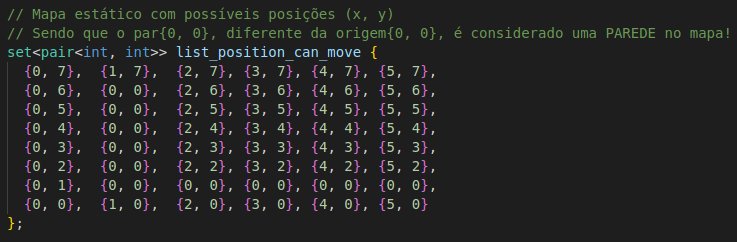
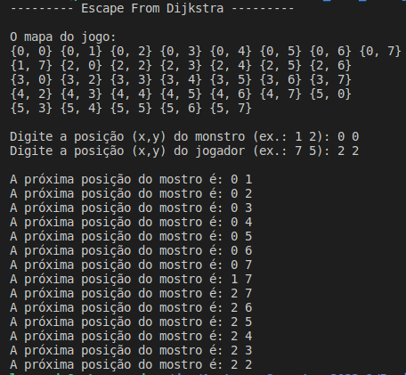
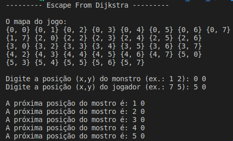
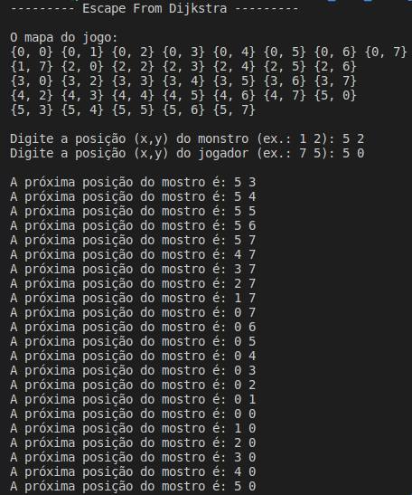

# Escape-From-Dijkstra

**Número da Lista**: 1 
**Conteúdo da Disciplina**: Grafos 1 

## Alunos
| Matrícula | Aluno |
| -- | -- |
| 19/0045817  | Gabriel Costa de Oliveira      |
| 20/1000379  |  Leonardo Milomes Vitoriano |

## Sobre 

O **Escape From Dijkstra** é um jogo do gênero **Don't stop running** no qual o 'personagem' principal precisa escapar do vilão Dijsktra e econtrar a saída do labirinto, enquanto tem visão somente do mapa ao seu redor, simulando uma masmorra escura, e um personagem com uma tocha.

O repositório oficial do jogo pode ser encontrado [aqui](https://github.com/GameJamFGA-UnB/Escape-From-Dijkstra).

O plano principal era incrementarmos o jogo, aplicando no algoritmo de perseguição do mostro: a Busca em Largura (DFS).  Pois, a partir dela, seria possível que o monstro possuíse o menor caminho para encontrar o jogador. Mas, infelizmente, não conseguimos incorporar o incremento no jogo.

No entanto, para demonstrar que o nosso algoritmo de Busca em Largura funciona, a dupla implementou um mapa menor do que o do **Escape From Dijkstra**, e o método **busca_bsf** recebe como parâmetros a posicão estática cartesiana (eixo x e y) do monstro e do jogador no mapa, e imprime, a partir do menor caminho, todos os passos que o monstro realizou até alcançar, de fato, o jogador.

É importante destacar que, a cada iteração, o monstro só pode executar um movimento, ou seja, ele pode:
- Ir para cima em 1 unidade no eixo y; ou
- Ir para baixo em 1 unidade no eixo y; ou
- Ir para esquerda em 1 unidade no eixo x; ou
- Ir para direita em 1 unidade no eixo x;

## Screenshots

Na figura 1, encontra-se mapa estático do jogo no qual os testes foram realizados:

Figura 1 - Mapa Estático.

Na figura 2, encontra-se o Caso Teste 1.  

Figura 2 - Caso Teste 1.

Na figura 3, encontra-se o Caso Teste 2.  

Figura 3 - Caso Teste 2.

Na figura 4, encontra-se o Caso Teste 3.  

Figura 4 - Caso Teste 3.

## Instalação 
**Linguagem**: C++ 

É necessário ter pré-instalados e configurados na sua máquina:
- [gcc](https://gcc.gnu.org/);

No **Linux**, para instalar o **g++**, execute o seguinte comando:

    sudo apt-get install build-essential

Após instalar as dependências do projeto, realize os seguintes comandos: 

    git clone https://github.com/projeto-de-algoritmos/Grafos1_Escape-From-Dijkstra.git
    cd Grafos1_Escape-From-Dijkstra
    g++ Grafos1.cpp

Agora o seu ambiente agora está configurado. Basta apenas digitar o comando:

    ./a.out

Pronto! Sinta-se livre para modificar o mapa e testar os menores caminhos possíveis!

## Uso 

O uso é muito simples, depois de entrar no diretório raiz do jogo, e executar:

    g++ Grafos1.cpp
    ./a.out

Será mostrado o mapa do jogo, e serão necessários 2 entradas:
- A 1ª entrada corresponde as coordenadas cartesianas (x, y) aonde o monstro encontra-se no mapa; e
- A 2ª entrada corresponde as coordenadas cartesianas (x, y) aonde o jogador encontra-se no mapa;

Após as entradas, o algoritmo irá retornar como saída:
- Cada passo que o monstro realizou para encontrar o jogador! 

## Vídeo

O vídeo explicando o algoritmo e o funcionamento dele, pode ser encontrado no link a seguir:
- [Vídeo](https://youtu.be/emkVW0FeutQ)

